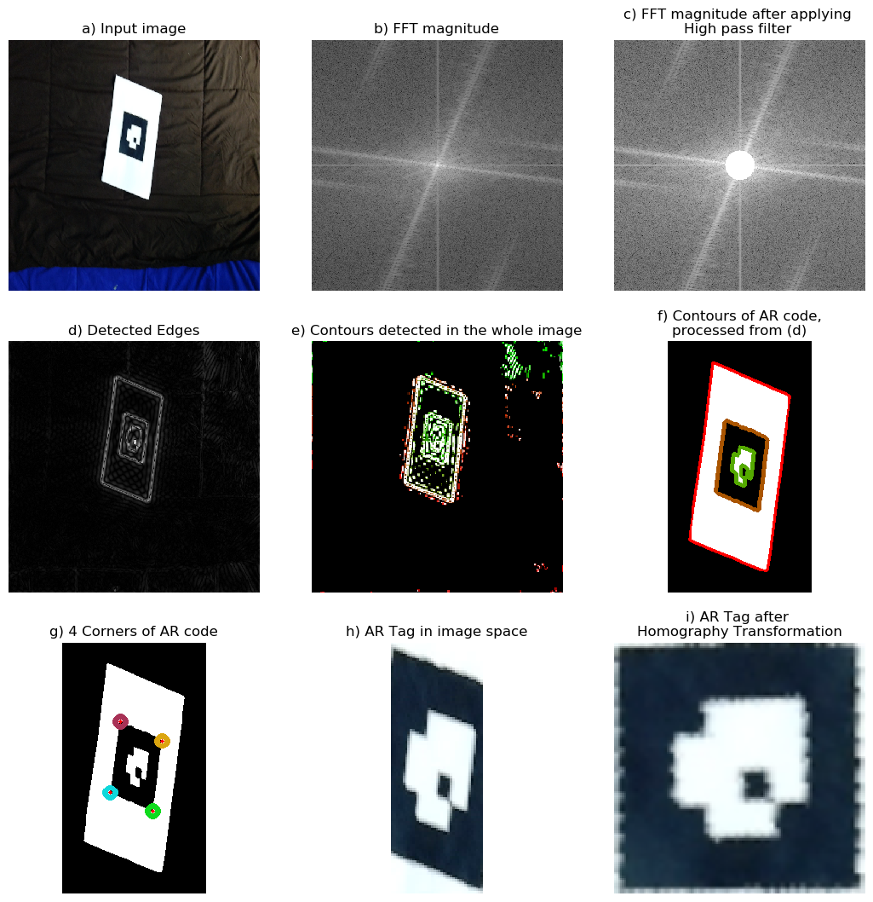
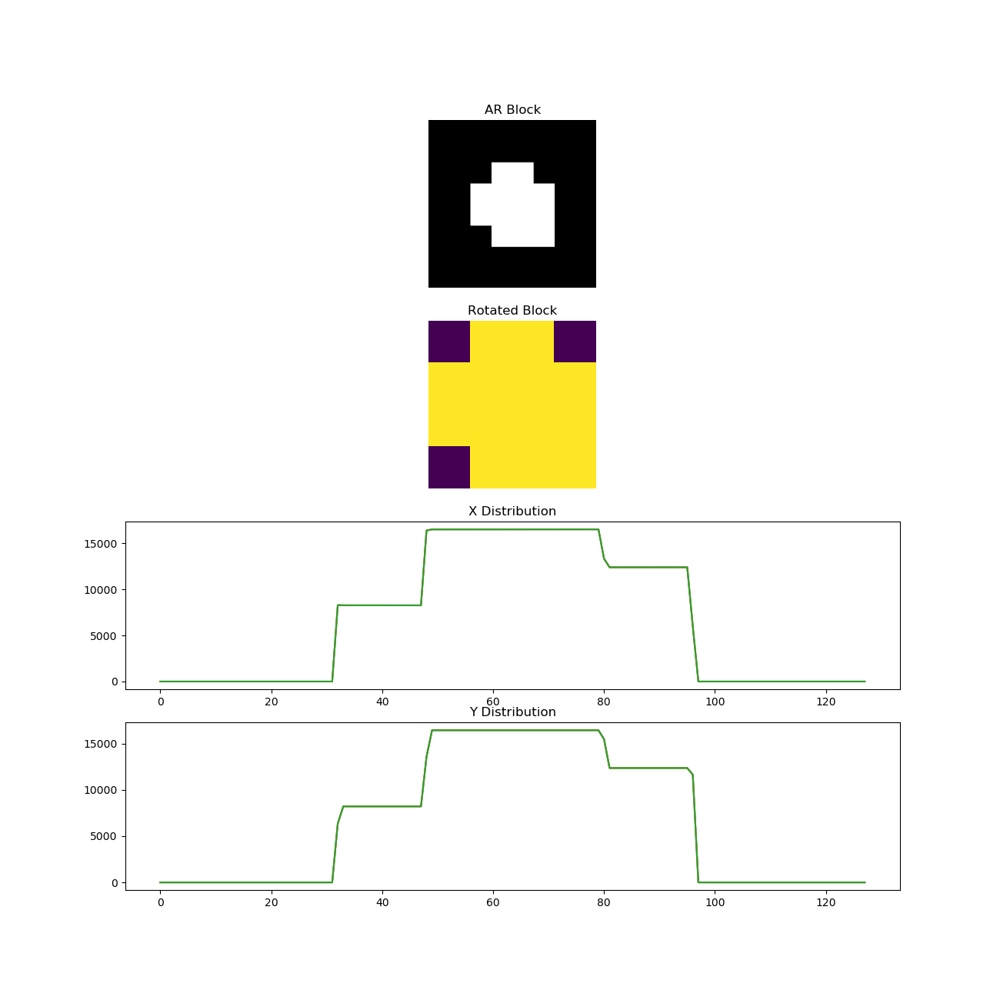
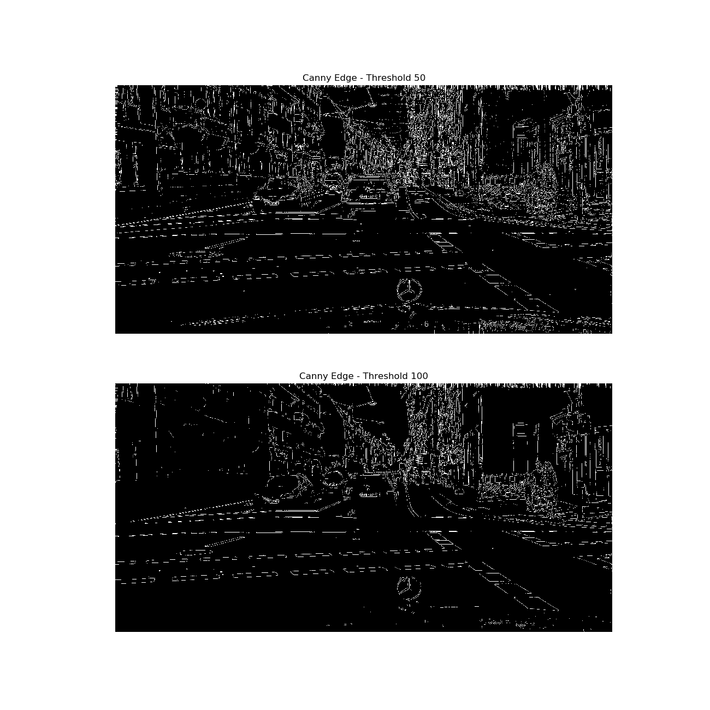
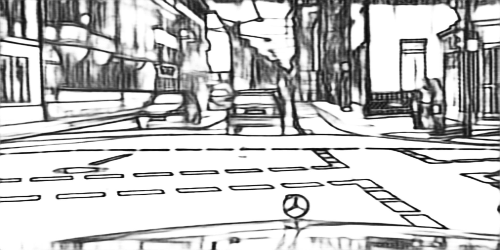

# Project 1
- Name: Aswath Muthuselvam
- UID: 118286204
- Course: ENPM 673 - Perception for Autonomous Robots
Access the Report for this project [here](docs/report.pdf).
## Problem 1:
AR Code detection:

## Problem 2:

## Extra Credit:

Canny Edge detection on Cityscape

Edge detection with DexiNed

