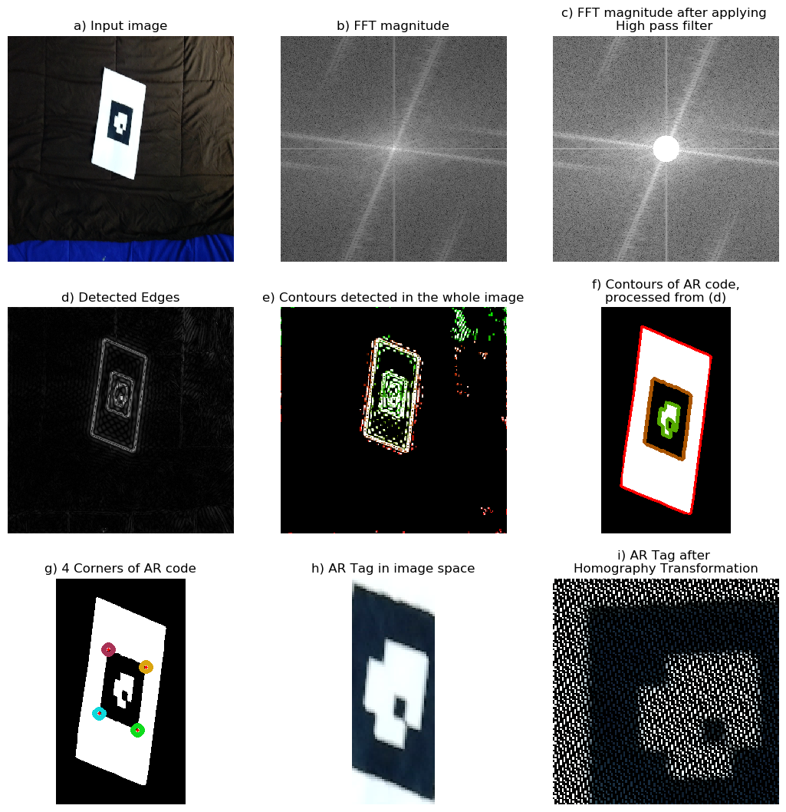
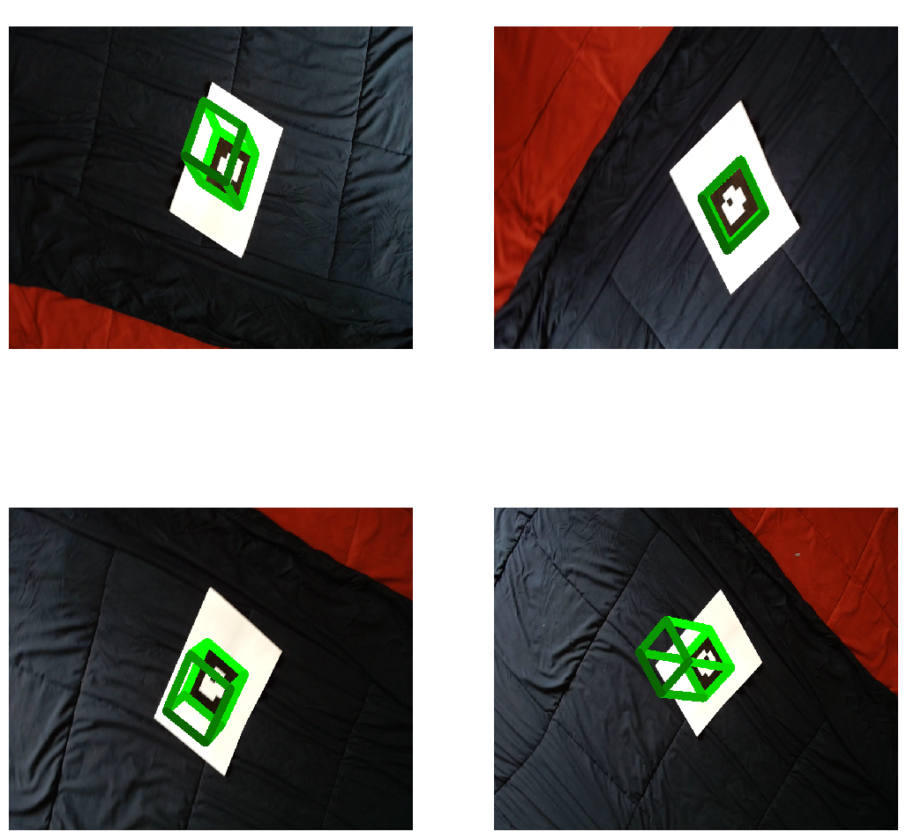

# Project 1
- Name: Aswath Muthuselvam
- UID: 118286204
- Course: ENPM 673 - Perception for Autonomous Robots
Access the Report for this project [here](docs/report.pdf).

## Steps to Run the code:
### Install dependencies:
```bash
pip3 install -r requirements.txt
```
### Run the code:
```bash
cd code
python3 solution.py
```

## Outputs:
### Problem 1:
AR Code detection:


AR Code decoding:


### Problem 2:
Testudo Projection:


AR Cube Projection


### Extra Credit:

Canny Edge detection on Cityscape


Edge detection with DexiNed

