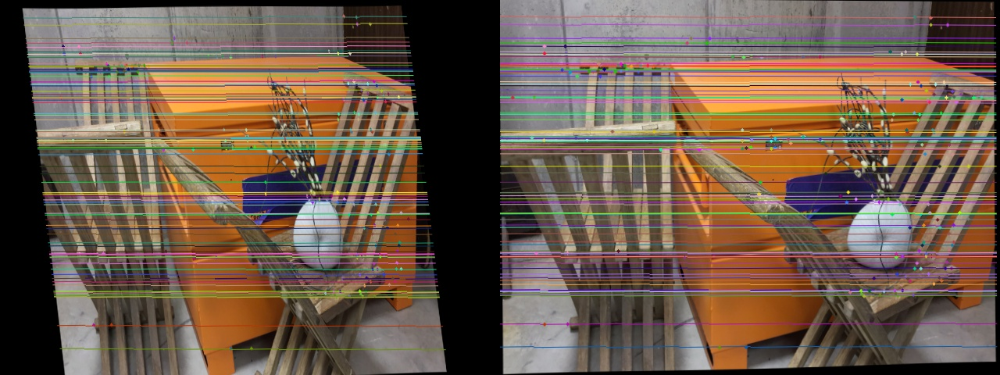
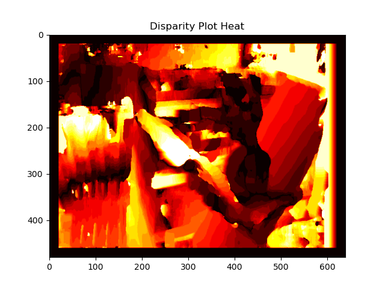
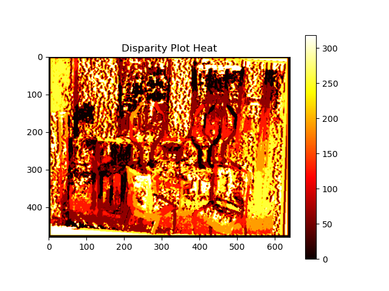

# Project 3
- Name: Aswath Muthuselvam
- UID: 118286204
- Course: ENPM 673 - Perception for Autonomous Robots
Access the Report for this project [here](docs/report.pdf).

## Steps to Run the code:
### Install dependencies:
```bash
pip3 install -r requirements.txt
```
### Run the code:
```bash
cd code
python3 solution.py
```
- [libs.py](code/libs.py) contains Class and Memeber functions used for computing depth.


## Outputs:



